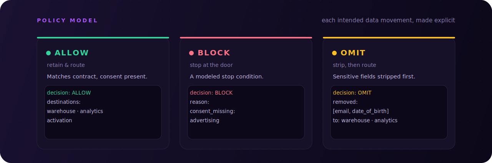

<div align="center">


<br/>
<br/>

<a href="https://bootstrapdata.in"></a>
&nbsp;&nbsp;
<a href="mailto:contact@bootstrapdata.in?subject=Bootstrap%20Data%20early%20access"></a>

</div>

<br/>

## The problem every data team knows

Most data platforms trust first and govern later. Data spreads across warehouses, analytics tools, and ad platforms before anyone asks whether it should have.

- **Schema drift** — events reach downstream tools before anyone reviews a schema change.
- **Blurred boundaries** — PII reaches warehouses and ad platforms because no single layer owns the boundary.
- **Consent amnesia** — consent is captured in a banner and forgotten the moment data starts flowing.
- **Governance lag** — governance is a quarterly audit, not a property of the pipeline itself.
- **Slow handoffs** — policy handoffs between engineering and legal slow every launch that touches user data.

## One control plane changes the equation

Bootstrap Data inverts that order — bringing contracts, sensitive-data policies, and consent mappings into the same layer where each source is configured.

- Define an explicit, **versioned contract** for each event type.
- **Model and classify** PII and SPII fields, making sensitive-data policy visible and reviewable.
- Map **consent categories** directly to destination routing decisions in the same model.
- Keep governance configuration **centralized, permissioned, and auditable** across teams.
- Reuse **synchronized blueprints** to eliminate redundant work as sources multiply.

> **Governance as an engineering workflow.** Engineering teams already configure data pipelines. The question is whether governance is modeled at that layer — or reconstructed after data has spread. Bootstrap Data makes governance a first-class engineering concern: versioned, reviewable, and connected to each source configuration.

## Three decisions. One shared language

The policy model makes each intended data movement explicit — allow it, block it, or omit sensitive fields.

<div align="center">



</div>

## Follow one event through the model

A source configuration connects five concerns — collection, contracts, governance, routing intent, and configuration audit — in one coherent model.

<div align="center">



</div>

| Stage | What happens |
| :-- | :-- |
| **Capture** | Accept Segment-compatible events from web, mobile, server, and batch sources. Familiar shapes — `track`, `page`, `screen`, `identify`, `group` — work without pipeline rewrites. |
| **Contract** | Give every event a versioned shape. Reusable event and property blueprints become the single explicit contract across all sources. |
| **Govern** | Classify fields as PII or SPII with key, value, and regex matchers. Map consent categories to what was actually granted, with propagation policy configured per rule. |
| **Route** | Connect governance policy to destination configuration so intended data movement is explicit and reviewable — `ALLOW`, `BLOCK`, or `OMIT`. |
| **Audit** | Review policy and connection history. Permissioned mutations mean governance changes require explicit authorization. |

```yaml
# 03 Govern  →  04 Route
fields.user_email:    PII   → omit_rule: strip_before_route
fields.date_of_birth: SPII  → omit_rule: strip_always
consent.analytics:    granted

decision: OMIT
removed: [user_email, date_of_birth]
proposed_destinations:
  - warehouse    ✓  analytics consent present
  - activation   ✗  advertising consent absent
```

## Built for teams that think in contracts

Each capability is independently deployable and modular — ingestion scales separately from the control plane.

<table>
<tr>
<td width="50%" valign="top">

**Segment-compatible collection**

Drop-in ingestion for events already shaped for Segment-style pipelines. `track`, `page`, `screen`, `identify`, `group`, `alias`, and batch shapes supported.

</td>
<td width="50%" valign="top">

**Contract-generated clients**

Versioned OpenAPI contracts generate type-safe clients that stay in sync as contracts evolve.

</td>
</tr>
<tr>
<td width="50%" valign="top">

**Reusable blueprints**

Define event and property blueprints once. Synchronize read-only copies to sources, or snapshot an editable copy to customize.

</td>
<td width="50%" valign="top">

**PII / SPII classification**

Model sensitive fields with key, value, and regex matchers. Configure allow, block, or omit policies per rule, per destination.

</td>
</tr>
<tr>
<td width="50%" valign="top">

**Consent-gated routing**

Map consent categories directly to destination routing decisions. Configuration is versioned and reviewable alongside contracts.

</td>
<td width="50%" valign="top">

**Permissioned audit history**

Every governance mutation requires explicit authorization. Policy version, actor, and timestamp are recorded against each change.

</td>
</tr>
</table>

<div align="center">

`SOURCE TYPES`&nbsp;&nbsp;·&nbsp;&nbsp;Android&nbsp;&nbsp;·&nbsp;&nbsp;iOS&nbsp;&nbsp;·&nbsp;&nbsp;JavaScript&nbsp;&nbsp;·&nbsp;&nbsp;Unity&nbsp;&nbsp;·&nbsp;&nbsp;Direct&nbsp;API

`GENERATED CLIENTS`&nbsp;&nbsp;·&nbsp;&nbsp;TypeScript&nbsp;&nbsp;·&nbsp;&nbsp;Java&nbsp;&nbsp;·&nbsp;&nbsp;Kotlin&nbsp;&nbsp;·&nbsp;&nbsp;Swift&nbsp;&nbsp;·&nbsp;&nbsp;Python

</div>

## Every team that touches data

<table>
<tr>
<td width="33%" valign="top">

**Data platform engineers**

*Replace ad-hoc pipeline policies with versioned configuration.*

- Define data contracts once; reuse across every source.
- Make schema changes explicit and reviewable at the contract layer.
- Review destination policy centrally, not source by source.
- Reduce migration work with Segment-compatible event shapes.

</td>
<td width="33%" valign="top">

**Analytics engineers**

*Make trust requirements explicit before data reaches your models.*

- Keep declared contracts and schema rules visible in one model.
- Define the minimized payload each destination should receive.
- Connect warehouse mapping intent to the governing source policy.
- Review governance through a normal change workflow.

</td>
<td width="33%" valign="top">

**Privacy & governance teams**

*Make privacy decisions explicit, not archaeological.*

- Model PII and SPII classifications alongside source configuration.
- See consent-to-destination mappings in one reviewable model.
- Review who changed which policy, and when, from history.
- Align engineering and legal on one shared data language.

</td>
</tr>
</table>

<br/>

<div align="center">


<br/>
<br/>

<a href="https://bootstrapdata.in"></a>
&nbsp;&nbsp;
<a href="mailto:contact@bootstrapdata.in?subject=Bootstrap%20Data%20early%20access"></a>

</div>

<div align="center"></div>

<div align="center">


**Bootstrap Data** &nbsp;—&nbsp; governance-native control plane for first-party customer data.

<sub><i>Capabilities described here are in active development. Access is limited.</i></sub>

</div>
