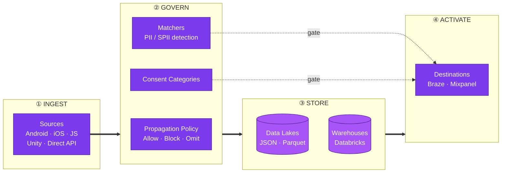
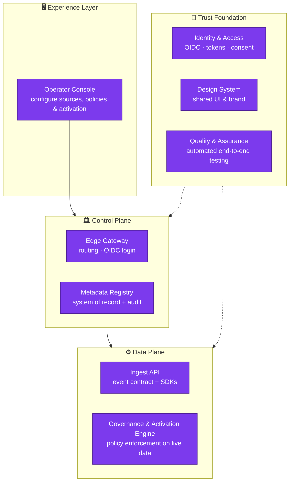

 

<b>Bootstrap Data is the privacy-first control plane for first-party customer data</b> — one place to capture every signal your product emits, decide exactly what is allowed to flow and where, and route it to your lakes, warehouses, and the tools your teams live in. Governed. Audited. Consent-aware. By design, not by patch.

 

---

## 💡 The problem we're solving

Every product is a firehose of first-party signals — taps, views, purchases, identities. That data is your most valuable asset <b>and</b> your biggest liability. Most teams face an impossible trade-off:

> Move fast and risk leaking PII, breaking consent, and losing the trust you spent years earning — **or** lock everything down and starve your growth, analytics, and activation teams of the data they need.

<b>Bootstrap Data refuses that trade-off.</b> We make governance the <i>fast</i> path — so shipping data responsibly is easier than shipping it recklessly.

---

## 🌊 The data journey

From the moment an event is born to the moment it powers a campaign, every hop is deliberate, inspected, and logged.

<b>① Ingest</b> — Register a <b>Source</b> for every channel — Android, iOS, JavaScript, Unity, Direct API — each with its own write key and configuration. Turn any product surface into a governed data stream in minutes.

<b>② Govern</b> — This is our heart. Every source carries a mandatory <b>Propagation Policy</b> that decides — per concern — whether to <b>Allow, Block, or Omit</b> unplanned events, unplanned attributes, schema violations, <b>PII</b>, and <b>SPII</b>. <b>Matchers</b> scan keys and values to classify sensitive data automatically, and <b>Consent Categories</b> decide which destinations that data is ever allowed to reach. Governance lives <i>at the point of ingestion</i> — so nothing ungoverned ever gets downstream.

<b>③ Store</b> — <b>Data Lakes</b> define object-store sinks (bucket, format, compression, retention); <b>Warehouses</b> connect compute targets like Databricks. Your data, in your infrastructure, on your terms.

<b>④ Activate</b> — <b>Destinations</b> like Braze and Mixpanel receive exactly the sources you choose, reshaped by field-level <b>Mappings</b> into precisely what each downstream tool expects — and never anything a user hasn't consented to.

---

## ✨ Why it's different

<table>
<tr>
<td width="33%" valign="top" align="justify">

### 🛡️ Privacy is the model
PII/SPII classification, consent gating, and propagation rules aren't a compliance bolt-on — they're **first-class entities** in the domain. If it isn't allowed, it doesn't move.

</td>
<td width="33%" valign="top" align="justify">

### 🧭 Governance at the edge
Policies attach to the **source itself**. Ungoverned data can't sneak in downstream, because there is no downstream without a policy.

</td>
<td width="33%" valign="top" align="justify">

### 🧾 Nothing is invisible
Every change to every entity is **version-tracked and audited**. Full history, full accountability, zero guesswork about who changed what.

</td>
</tr>
</table>

---

## 🚀 The vision — where this goes

Today Bootstrap Data governs the flow of first-party data. Tomorrow it becomes the <b>trust layer for the entire customer-data lifecycle</b>:

- 🔴 **Real-time activation** — governed streams that light up destinations the instant a signal lands, not hours later.
- 🧠 **Consent as code** — user consent that propagates automatically across every lake, warehouse, and destination, revocable everywhere in one action.
- 🤖 **Self-serve, AI-assisted governance** — describe intent in plain language; the platform proposes the matchers, policies, and mappings, then keeps schemas honest as your product evolves.
- 🔌 **An open destination & source ecosystem** — every major product SDK on one side, every marketing and analytics tool on the other, all speaking one governed contract.
- 🏛️ **Provable compliance** — turn "are we compliant?" from a quarterly scramble into a live, queryable answer.

<b>The north star:</b> make responsible use of customer data the <i>default</i> — so great teams can move fast <i>because</i> they respect their users, not despite it.

---

## 🧩 The architecture

Bootstrap Data is composed of focused, independently-evolving building blocks that separate <i>deciding what's allowed</i> from <i>doing the work</i> — a classic control-plane / data-plane split, wrapped in trust.

| Component | Role in the platform |
|---|---|
| 🖥️ **Operator Console** | The single pane of glass where teams register sources, author governance policies, and wire up activation — no code required. |
| 🏛️ **Edge Gateway** | The one secure front door: authenticates every visitor, then routes traffic to the right service. |
| 📇 **Metadata Registry** | The system of record for every source, policy, matcher, mapping, and destination — fully validated and version-audited. |
| 📜 **Ingest API** | The governed contract (and SDKs) every product uses to stream first-party events into the platform. |
| ⚙️ **Governance & Activation Engine** | The runtime that enforces propagation policies and consent on live data, then routes it to lakes, warehouses, and destinations. |
| 🔐 **Identity & Access** | OIDC authentication, personal access tokens, and consent — the trust primitives woven through every layer. |
| 🎨 **Design System** | Shared, accessible UI components and brand that give every surface one consistent, polished feel. |
| 🧪 **Quality & Assurance** | Continuous end-to-end and API testing that keeps the whole platform honest, release after release. |

---

## 🛠️ Built with

**Backend** — Java 21 · Spring Boot · Spring Cloud Gateway · JHipster · PostgreSQL (`jsonb`) · Redis · Consul · Keycloak (OIDC / OAuth2)

**Frontend** — React microfrontends (Module Federation) · Redux · shadcn/ui · Tailwind CSS · TanStack Table · internationalized in English, Hindi & Japanese

**Engineered for trust** — validated domain constraints · filtering, pagination & search on every list · complete audit history · automated CI and end-to-end testing

---

<picture>
  <source media="(prefers-color-scheme: dark)" srcset="./assets/logo-mark.svg">
  
</picture>

**Bootstrap Data** — first-party data, governed end to end.

*Built with intention. Private by default.*

