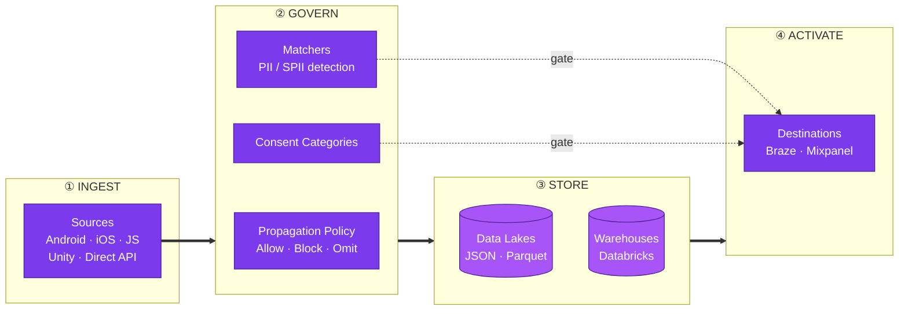
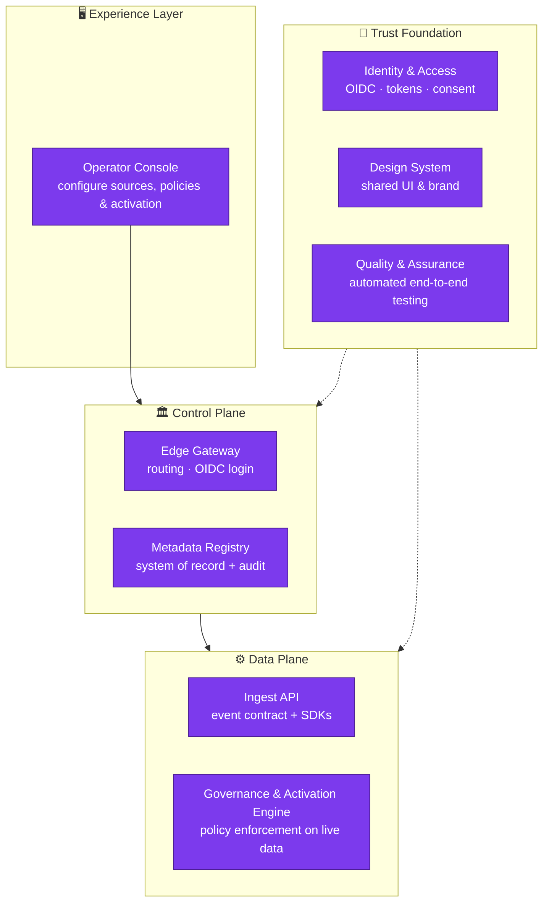

 

<b>Bootstrap Data is the privacy-first control plane for first-party customer data.</b> 
One place to capture every signal your product emits, decide exactly what is allowed to flow — and&nbsp;where — then route it to your lakes, warehouses, and the tools your teams live in. 
<b>Governed. Audited. Consent-aware.</b> By design, not by patch.

 

 

<h2 align="center">💡&nbsp;&nbsp;The problem we solve</h2>

Every product is a firehose of first-party signals — taps, views, purchases, identities. That data is your most valuable asset <b>and</b> your biggest liability. Most teams are forced into an impossible trade-off:

> Move fast and risk leaking PII, breaking consent, and losing the trust you spent years earning — **or** lock everything down and starve your growth, analytics, and activation teams of the data they need.

<b>Bootstrap Data refuses that trade-off.</b> We make governance the <i>fast</i> path — so shipping data responsibly is easier than shipping it recklessly.

 

<h2 align="center">🌊&nbsp;&nbsp;The data journey</h2>

From the moment an event is born to the moment it powers a campaign, every hop is deliberate, inspected, and logged.

<b>①&nbsp;&nbsp;Ingest</b> &nbsp;—&nbsp; Register a <b>Source</b> for every channel — Android, iOS, JavaScript, Unity, Direct API — each with its own write key and configuration. Turn any product surface into a governed data stream in minutes.

<b>②&nbsp;&nbsp;Govern</b> &nbsp;—&nbsp; This is our heart. Every source carries a mandatory <b>Propagation Policy</b> that decides — per concern — whether to <b>Allow, Block, or Omit</b> unplanned events, unplanned attributes, schema violations, <b>PII</b>, and <b>SPII</b>. <b>Matchers</b> scan keys and values to classify sensitive data automatically, and <b>Consent Categories</b> decide which destinations that data is ever allowed to reach. Governance lives <i>at the point of ingestion</i> — so nothing ungoverned ever gets downstream.

<b>③&nbsp;&nbsp;Store</b> &nbsp;—&nbsp; <b>Data Lakes</b> define object-store sinks (bucket, format, compression, retention); <b>Warehouses</b> connect compute targets like Databricks. Your data, in your infrastructure, on your terms.

<b>④&nbsp;&nbsp;Activate</b> &nbsp;—&nbsp; <b>Destinations</b> like Braze and Mixpanel receive exactly the sources you choose, reshaped by field-level <b>Mappings</b> into precisely what each downstream tool expects — and never anything a user hasn't consented to.

 

<h2 align="center">✨&nbsp;&nbsp;What makes it different</h2>

<table>
<tr>
<td width="33%" valign="top" align="center">
<h3>🛡️ Privacy is the model</h3>

PII/SPII classification, consent gating, and propagation rules aren't a compliance bolt-on — they're <b>first-class entities</b> in the domain. If it isn't allowed, it doesn't move.

</td>
<td width="33%" valign="top" align="center">
<h3>🧭 Governance at the edge</h3>

Policies attach to the <b>source itself</b>. Ungoverned data can't sneak in downstream, because there is no downstream without a policy.

</td>
<td width="33%" valign="top" align="center">
<h3>🧾 Nothing is invisible</h3>

Every change to every entity is <b>version-tracked and audited</b>. Full history, full accountability, zero guesswork about who changed what.

</td>
</tr>
</table>

 

<h2 align="center">🚀&nbsp;&nbsp;The vision</h2>

Today Bootstrap Data governs the flow of first-party data. Tomorrow it becomes the <b>trust layer for the entire customer-data lifecycle</b>:

| Horizon | What it unlocks |
| :-- | :-- |
| 🔴 &nbsp;**Real-time activation** | Governed streams that light up destinations the instant a signal lands — not hours later. |
| 🧠 &nbsp;**Consent as code** | User consent that propagates across every lake, warehouse, and destination — revocable everywhere in one action. |
| 🤖 &nbsp;**AI-assisted governance** | Describe intent in plain language; the platform proposes matchers, policies, and mappings, then keeps schemas honest as your product evolves. |
| 🔌 &nbsp;**Open connector ecosystem** | Every major product SDK on one side, every marketing and analytics tool on the other — all speaking one governed contract. |
| 🏛️ &nbsp;**Provable compliance** | Turn "are we compliant?" from a quarterly scramble into a live, queryable answer. |

<b>The north star</b> &nbsp;—&nbsp; make responsible use of customer data the <i>default</i>, so great teams can move fast <i>because</i> they respect their users, not despite it.

 

<h2 align="center">🧩&nbsp;&nbsp;The architecture</h2>

Bootstrap Data is composed of focused, independently-evolving building blocks that separate <i>deciding what's allowed</i> from <i>doing the work</i> — a classic control-plane / data-plane split, wrapped in trust.

| Component | Role in the platform |
| :-- | :-- |
| 🖥️ &nbsp;**Operator Console** | The single pane of glass where teams register sources, author governance policies, and wire up activation — no code required. |
| 🏛️ &nbsp;**Edge Gateway** | The one secure front door: authenticates every visitor, then routes traffic to the right service. |
| 📇 &nbsp;**Metadata Registry** | The system of record for every source, policy, matcher, mapping, and destination — fully validated and version-audited. |
| 📜 &nbsp;**Ingest API** | The governed contract (and SDKs) every product uses to stream first-party events into the platform. |
| ⚙️ &nbsp;**Governance &amp; Activation Engine** | The runtime that enforces propagation policies and consent on live data, then routes it to lakes, warehouses, and destinations. |
| 🔐 &nbsp;**Identity &amp; Access** | OIDC authentication, personal access tokens, and consent — the trust primitives woven through every layer. |
| 🎨 &nbsp;**Design System** | Shared, accessible UI components and brand that give every surface one consistent, polished feel. |
| 🧪 &nbsp;**Quality &amp; Assurance** | Continuous end-to-end and API testing that keeps the whole platform honest, release after release. |

 

<h2 align="center">🛠️&nbsp;&nbsp;The stack</h2>

| Layer | Technologies |
| :-- | :-- |
| ⚙️ &nbsp;**Backend** | Java 21 · Spring Boot · Spring Cloud Gateway · JHipster · PostgreSQL (`jsonb`) · Redis · Consul · Keycloak (OIDC / OAuth2) |
| 🎨 &nbsp;**Frontend** | React microfrontends (Module Federation) · Redux · shadcn/ui · Tailwind CSS · TanStack Table · i18n (English · Hindi · Japanese) |
| 🛡️ &nbsp;**Trust &amp; Quality** | Validated domain constraints · filtering, pagination &amp; search on every list · complete audit history · automated CI &amp; end-to-end testing |

 

---

<picture>
  <source media="(prefers-color-scheme: dark)" srcset="./assets/logo-mark.svg">
  
</picture>

 

<b>Bootstrap Data</b> &nbsp;—&nbsp; first-party data, governed end to end.
 
<i>Built with intention. Private by default.</i>

